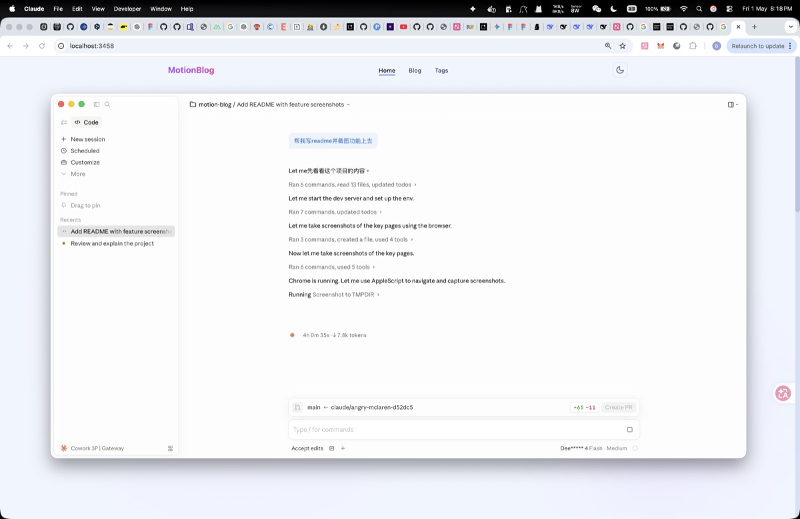
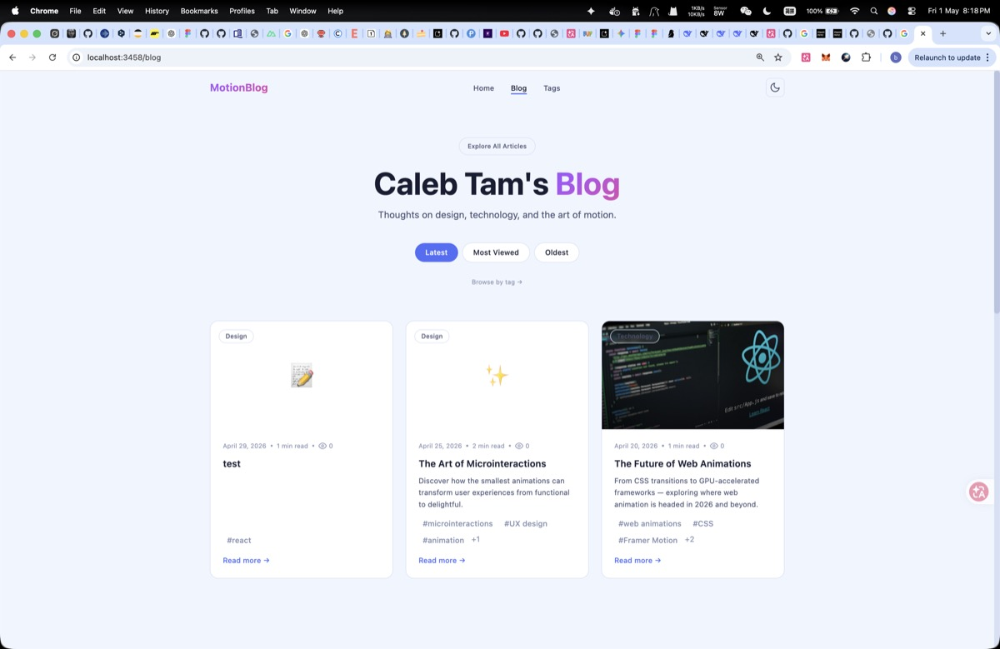
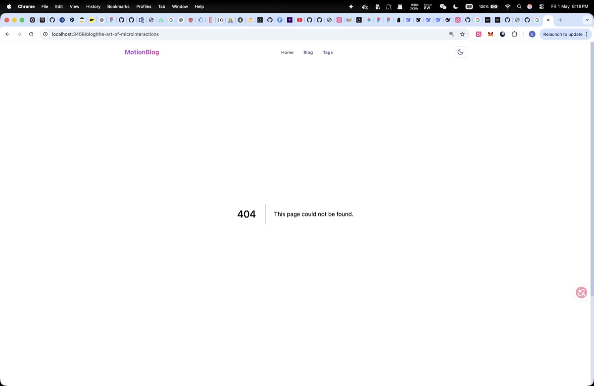
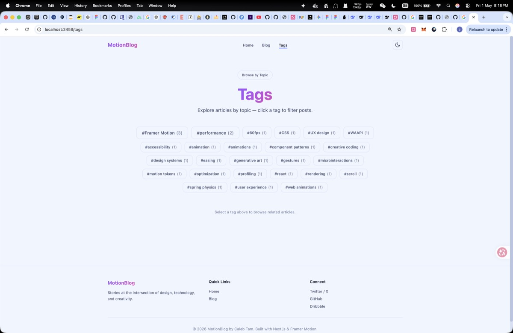
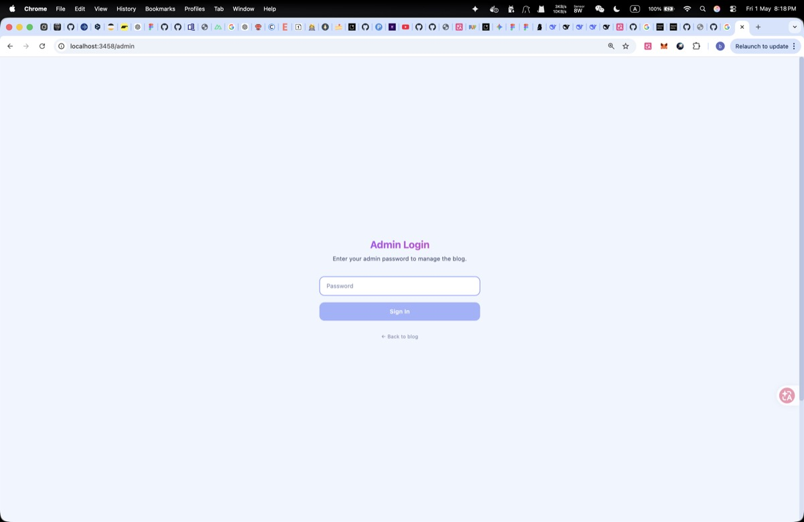

# MotionBlog

A design-focused blog built with **Next.js 14**, **Framer Motion**, and **Tailwind CSS**. Features a fully functional admin panel for managing posts without touching code.



## Features

### Public Site

| Feature | Description |
|---------|-------------|
| **Animated UI** | Spring physics, scroll-triggered animations, layout transitions powered by Framer Motion |
| **Light / Dark mode** | Toggle with persistence to localStorage; respects system preference |
| **Reading time** | Auto-calculated per post |
| **View counts** | Session-deduplicated, stored in localStorage |
| **Tags & filtering** | Tag cloud page with click-to-filter posts |
| **Related posts** | Tag-matching algorithm suggests related content |
| **Cover images** | Displayed on blog cards and post pages |
| **Markdown content** | Full GFM support via react-markdown with code blocks and copy button |
| **Reading progress bar** | Fixed position indicator on article pages |
| **Responsive** | Mobile-first design with fluid typography |

### Admin Panel (`/admin`)

- **Password-protected** — Server-validated auth with session token
- **CRUD posts** — Create, edit, delete blog posts from a dashboard
- **Image upload** — Upload cover images and inline images
- **Markdown editor** — Raw editing with live preview toggle
- **Inline image insertion** — Upload images directly into markdown content
- **Slug management** — Auto-sanitized URL identifiers with uniqueness checks

## Screenshots

<div align="center">
  <table>
    <tr>
      <td></td>
      <td></td>
    </tr>
    <tr>
      <td align="center"><em>Homepage with animated hero</em></td>
      <td align="center"><em>Blog listing with sort options</em></td>
    </tr>
    <tr>
      <td></td>
      <td></td>
    </tr>
    <tr>
      <td align="center"><em>Blog post with code blocks & progress bar</em></td>
      <td align="center"><em>Tag cloud with filtering</em></td>
    </tr>
    <tr>
      <td colspan="2"></td>
    </tr>
    <tr>
      <td colspan="2" align="center"><em>Admin panel login</em></td>
    </tr>
  </table>
</div>

## Tech Stack

| Layer | Technology |
|-------|-----------|
| Framework | [Next.js 14](https://nextjs.org/) (App Router) |
| Language | [TypeScript](https://www.typescriptlang.org/) |
| Animations | [Framer Motion](https://framermotion.framer.website/) |
| Styling | [Tailwind CSS](https://tailwindcss.com/) with CSS custom properties |
| Markdown | [react-markdown](https://github.com/remarkjs/react-markdown) + [remark-gfm](https://github.com/remarkjs/remark-gfm) |
| Data | JSON file (`content/posts.json`) |

## Getting Started

### Prerequisites

- Node.js 18+
- npm or yarn

### Install

```bash
cd motion-blog
npm install
```

### Configure

Set your admin password in `.env.local`:

```env
ADMIN_PASSWORD=your_password_here
```

### Run

```bash
npm run dev
```

Open [http://localhost:3000](http://localhost:3000) for the blog.  
Open [http://localhost:3000/admin](http://localhost:3000/admin) for the admin panel.

### Build for production

```bash
npm run build
npm start
```

## Project Structure

```
src/
├── app/
│   ├── admin/          # Admin panel (login, posts dashboard, create/edit)
│   ├── api/            # API routes (auth, posts CRUD, image upload)
│   ├── blog/           # Blog listing and individual post pages
│   ├── tags/           # Tag cloud and filtered post display
│   ├── layout.tsx      # Root layout with ThemeProvider
│   ├── page.tsx        # Home page (hero, featured posts, stats)
│   └── globals.css     # Theme variables (light + dark)
├── components/
│   ├── BlogCard.tsx    # Blog post card with image, tags, views
│   ├── Header.tsx      # Navigation with theme toggle
│   ├── Footer.tsx      # Site footer
│   ├── HeroSection.tsx # Home page hero with animated background
│   └── ThemeProvider.tsx # Light/dark mode context provider
└── lib/
    ├── posts.ts        # Post data access & utilities
    └── views.ts        # View count with session deduplication

content/
└── posts.json          # Blog post data store
```

## Adding Posts

### Via admin panel (recommended)

1. Go to `/admin` and sign in with your `ADMIN_PASSWORD`
2. Click **+ New Post**
3. Fill in title, slug, content (Markdown), optional cover image and tags
4. Click **Publish**

### Via JSON file

Edit `content/posts.json` directly and restart the server.

## Design System

The theme uses CSS custom properties, making it easy to customize:

- **`--color-surface`** — Page background
- **`--color-surface-light`** — Card/elevated surface background
- **`--color-surface-lighter`** — Borders and subtle surfaces
- **`--color-accent`** — Primary accent (blue: #4f6ef7)
- **`--color-text-primary`** — Main text color
- **`--color-text-secondary`** — Supporting text
- **`--color-text-muted`** — Muted / metadata text

Light and dark variants are defined in `src/app/globals.css`.

## License

MIT
